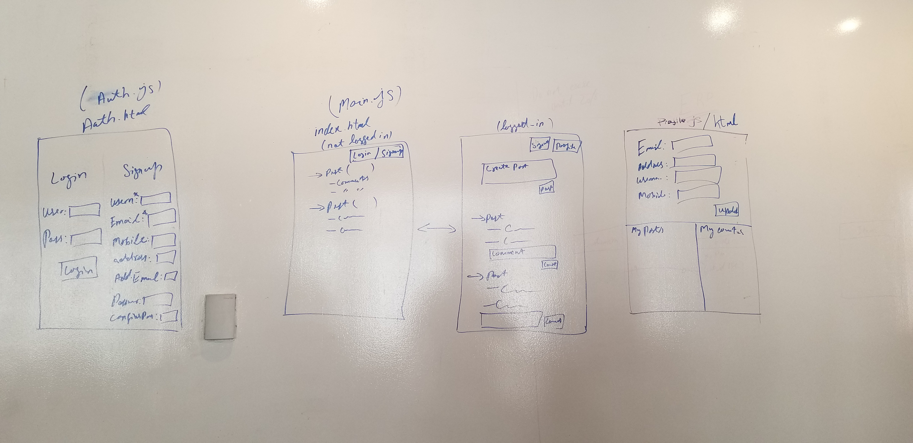

# Project-1

<h3 align="center">Foodie</h3>

<p align="center">
  Foodie is an a discussion forum where people post and comment on a food recipe. 
  <br>

  <br>
 
  ·
  <a href="http://gajjucoderboi.github.io/cognizant-p1/src/index">DEMO</a>
  ·
  <a href="https://www.pivotaltracker.com/n/projects/2400262">User Stories</a>
   ·
 
</p>

## Technology Used (Dependencies)

####Bootstrap

   We use the Bootstrap to style our html elements, paste following code inside the head tag:
   
   * Installation instructions 
   
    Include These files into he index.html
    
    <head>
       ..
        <link rel="stylesheet" href="https://maxcdn.bootstrapcdn.com/bootstrap/4.0.0/css/bootstrap.min.css" integrity="sha384-Gn5384xqQ1aoWXA+058RXPxPg6fy4IWvTNh0E263XmFcJlSAwiGgFAW/dAiS6JXm" crossorigin="anonymous">
       ..
    </head>
    <body>
        .
        .
        <script src="https://code.jquery.com/jquery-3.2.1.slim.min.js" integrity="sha384-KJ3o2DKtIkvYIK3UENzmM7KCkRr/rE9/Qpg6aAZGJwFDMVNA/GpGFF93hXpG5KkN" crossorigin="anonymous"></script>
        <script src="https://cdnjs.cloudflare.com/ajax/libs/popper.js/1.12.9/umd/popper.min.js" integrity="sha384-ApNbgh9B+Y1QKtv3Rn7W3mgPxhU9K/ScQsAP7hUibX39j7fakFPskvXusvfa0b4Q" crossorigin="anonymous"></script>
        <script src="https://maxcdn.bootstrapcdn.com/bootstrap/4.0.0/js/bootstrap.min.js" integrity="sha384-JZR6Spejh4U02d8jOt6vLEHfe/JQGiRRSQQxSfFWpi1MquVdAyjUar5+76PVCmYl" crossorigin="anonymous"></script>
    </body>
    
####Tools
 * Webstorm 
 * VS Code
 * VS Code Live Server
 * Postman (API Testing and Calls)


## Approaches Used

## User Stories

[Pivotal Tracker (Foodie App)](https://www.pivotaltracker.com/n/projects/2400262)

Application Goals from User Stories are:
    
* Sign-up and Create Profile Foodie User
* Anyone can See Posts and Comments
* Signed-in user able to post a Post and comment
* Signed-in user able to delete it's own Posts and Comments


## Wire Frame



## Timeline

1. Requirement Analysis
    * Tuesday(Sep 24, 2019) - user stories
        
        We give our user stories points, so that we could priority our development steps 
 
            https://www.pivotaltracker.com/n/projects/2400262

2. Development
    
    * Wednesday(Sep 25, 2019) - Home page, fetch all users post and comments and display on the home page.
    * Thursday(Sep 26, 2019) - Sign up page and login started
    * Friday(Sep 27, 2019) - All the post and comments functional works.
    * Friday(Sep 27, 2019) - Manual Testing - Finished profile page and testing all the possible error. 

3. Deployement
    * Friday(Sep 27, 2019) -  Deployed onto Github Sites
    
        <a href="http://gajjucoderboi.github.io/cognizant-p1/src/index">DEMO</a>
        
4. Presentation
    * Monday (Sep 30, 2019) - Presentation

## What's included

Within the download you'll find the following directories and files, logically grouping common assets and providing both compiled and minified variations. You'll see something like this:

```text
cognizant-p1/
├── README.md
└── src
    ├── css
    │   ├── main.css
    │   ├── profile.css
    │   └── signup.css
    ├── js
    │   ├── main.js
    │   ├── profile.js
    │   └── signup.js
    ├── index.html
    ├── profile.html
    └── signup.html

```

## Creators

**Mingjing Tang**

- <https://github.com/mingjingtang>

**Mohammad Javed**

- <https://github.com/gajjuCoderBoi>
